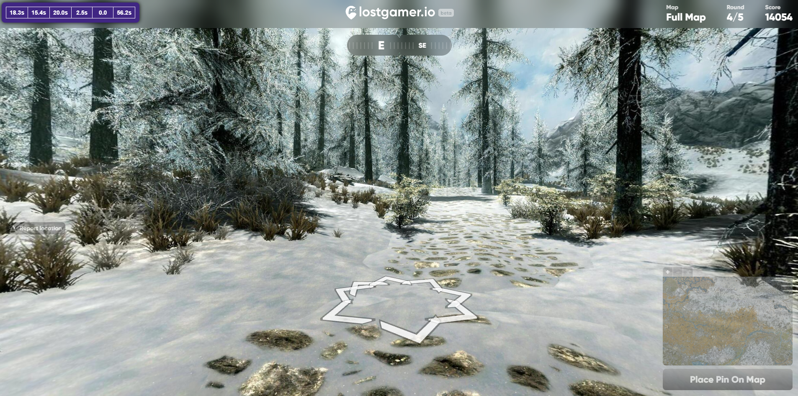

# Timer Plugin ⏱️  

## Overview 📋  
The **Timer Plugin** adds a small timer to the top-left corner of the screen.  
Perfect for setting speed records! 🚀  

---

## Limitations ⚠️  

- **5-Round Games Only**  
  Currently supports only 5-round games.  
  (It’s my favorite mode, and adding support for longer modes would make the timer too bulky. If you release a patch with better support, I’ll consider adding it!)  

- **Time Discrepancy**  
  The total real time differs slightly from the in-game time:  
  - Example: 60 seconds in-game = ~62 seconds on the timer.  
  - Likely caused by minor client lag.  

---

## How It Looks 🖼️  
  

---  
Enjoy breaking records! 🏆 
